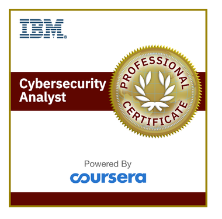
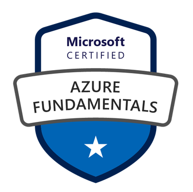

  
># **Cybersecurity Engineer | Penetration Tester | Incident Response Specialist**  
[LinkedIn](https://linkedin.com/in/frank-lamptey-9346a4177) | [Email](mailto:franklamp14@gmail.com) 

---

## 👋 About Me  
I am an IT security specialist driven by research and continuous learning.  
I enjoy exploring emerging threats, conducting vulnerability assessments, and developing security solutions.  
My work spans securing web, mobile, and API applications, enhancing incident response processes, and designing security testing frameworks.  

---

## 📄 My CV (Preview)   

[📥 Download My CV](docs/Frank-Ago-Lamptey-Resume.pdf)  

---

## 💼 Professional Experience  

### Supervisor, Security Testing (Quality Assurance Engineer)  
**Hubtel Ghana Limited** *(Aug 2023 – Present | Accra, Ghana)*  
Lead security testing initiatives for web, mobile, and API applications, conducting comprehensive penetration tests, vulnerability assessments, and risk evaluations to safeguard digital platforms. Oversee the design and continuous improvement of the organization’s security testing framework, integrating performance, load, and stress testing using tools such as JMeter and Locust. Collaborate with development and operations teams to guide remediation efforts, validate fixes, and ensure secure deployments. Provide technical expertise during incident response, particularly in vulnerability exploitation analysis. Drive efficiency through the development and maintenance of automated security and performance testing scripts, enhancing test coverage and scalability.  

---

### Security Operations Center Engineer  
**Fidelity Bank Ghana Limited** *(Nov 2021 – Aug 2023 | Accra, Ghana)*  
Monitored, detected, and responded to security incidents across the enterprise using SIEM solutions, enhancing incident response agility and reducing resolution times. Achieved a 92% endpoint security coverage rate by resolving Linux deployment challenges and optimizing anti-virus and anti-malware management for over 35,000 devices. Spearheaded automated vulnerability detection and remediation for third-party applications, increasing detection accuracy by 65%. Contributed to compliance and risk management efforts by developing incident response SOPs and playbooks, resulting in a 70% improvement in policy adherence. Coordinated with external penetration testers to achieve a 70% compliance rate and conducted internal vulnerability assessments to proactively address security gaps before solution rollouts.  
---

## 📜 Certifications  

| Certification | Issuer | Year |
|---------------|--------|------|
| **Certified Ethical Hacker (Master & Practical)** | EC-Council | 2024 |
| **Huawei Certified ICT Associate (Routing & Switching)** | Huawei | 2023 |
| **Certified in Cybersecurity** | ISC² | 2023 |
| **IT Automation with Python** | Google | 2023 |
| **IT Support** | Google | 2022 |
| **Computer Hacking Forensics Investigator (CHFI)** | EC-Council | 2022 |
| **IBM Certified Security Operations Analyst** | IBM | 2022 |
| **Microsoft Azure Fundamentals** | Microsoft | 2022 |

    
    
    
    
    
    
    

---

## 🛠 Skills & Tools  
- **Security Testing:** Penetration Testing, Vulnerability Assessment, Risk Analysis  
- **Incident Response:** Forensics, Breach & Attack Simulation (AttackIQ, Caldera)  
- **Programming:** Python, JavaScript, HTML, CSS, PHP, Laravel, Flutter  
- **Tools:** Postman, Burp Suite, OWASP ZAP, Nessus, Cisco ICE, Portnox, Kaspersky Endpoint Security, Wazuh  

---

## 📫 Get in Touch  
- **Email:** [franklamp14@gmail.com](mailto:franklamp14@gmail.com)  
- **LinkedIn:** [linkedin.com/in/frank-lamptey-9346a4177](https://linkedin.com/in/frank-lamptey-9346a4177)  

---

*© 2025 Frank Ago Lamptey*
